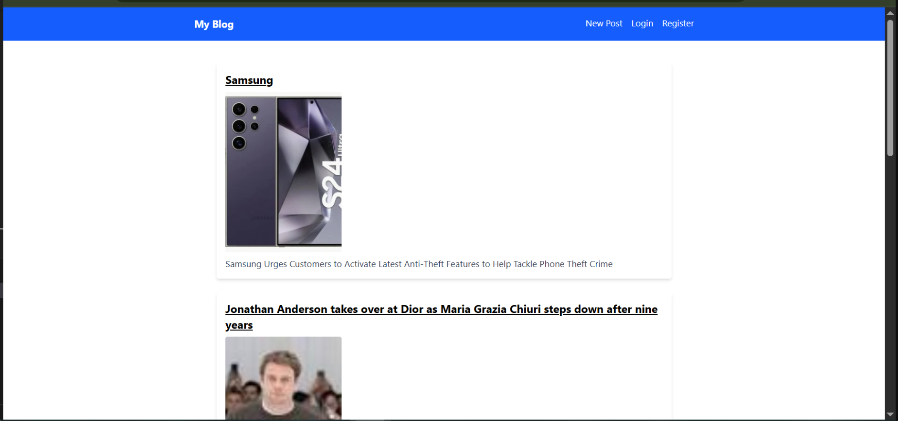

📝 Blog Platform
A full-stack blog application that allows users to create, edit, and browse blog posts with rich content formatting, categories, and optional image support.

🚀 Features
Create, edit, and delete blog posts
Categorize posts (e.g., Tech, Faith, Lifestyle, Other)
filter posts by title
image support via URL
Markdown or rich text formatting
Fast and responsive UI built with React
RESTful backend built with FastAPI
Tech Stack
Frontend

React (with Hooks & Context)
React Router
Tailwind CSS
React Hook Form + Zod (form validation)
Toast Notifications (react-hot-toast)
Backend

FastAPI
SQLite
CORS enabled for frontend connection
📸 Screenshots

